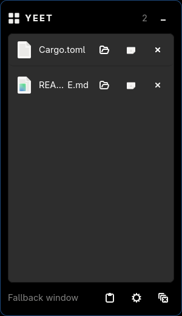

# Yeet

[](https://github.com/hjosugi/yeet/actions/workflows/ci.yml)

Wayland と Windows 向けの、Yoink ライクな軽量ドラッグ＆ドロップ shelf です。

ファイルを画面端の細い strip にドラッグすると shelf が現れます。いったん shelf
へ置いて移動先を開き、そこからもう一度ドラッグできます。受け入れられた drop
だけを削除し、Esc や無効な場所への drop で item を失いません。



開発中の main は **v0.5.3 を対象**にしています。application、Cargo packageとも
名前は単にYeetで、native Rust/GTK 4の単一codebaseです。v0.5系ではv0.4の全機能に
加え、itemごとの安定したID、重複itemを許可する設定、複数dropをまとめて選択する
設定、copy/move/cancelを明示的に扱うdrag完了policyを実装しています。ただし、
実装済みであることと各compositor/Windows環境での確認済みは区別しています。
実機確認状況は
[compositor matrix](docs/compositors.md)を参照してください。

## Quick start

Nix flakesを利用できるLinuxでは、そのまま起動できます。

```sh
nix run github:hjosugi/yeet -- --hidden
```

その他のLinuxではGTK 4と`gtk4-layer-shell`を先に導入し、下記の
[release archive](#linux-へインストール)または[source build](#ソースからビルド)を
利用します。edge strip非対応環境では`yeet --toggle`を使用してください。

Windowsでは[Scoop](https://scoop.sh)で導入できます
（`scoop bucket add yeet https://github.com/hjosugi/yeet` のあと `scoop install yeet`）。
または[Releases](https://github.com/hjosugi/yeet/releases)からsetup EXEまたは
portable ZIPを取得します。起動後、既定のCtrl+Alt+Yまたは通知領域のiconを左click
して表示します。global shortcutはSettingsから変更でき、同じshortcutを素早く2回
押すとclipboardを取り込みます。開発版や未署名artifactではSmartScreenが表示される
場合があります。

## 比較

<!-- markdownlint-disable MD013 -->

| 機能 | Yeet | Yoink (macOS) | DropPoint | dragon |
| --- | --- | --- | --- | --- |
| 画面端へのdrag中に表示 | 常駐する細いstrip | 対応 | 手動/shortcut | CLI起動 |
| Wayland native統合 | `gtk4-layer-shell`＋fallback | 対象外 | Chromium/Wayland | GTK 3、X11中心 |
| Windows対応 | 同じRust codebaseのnative backend | 非対応 | Electron版あり | 非対応 |
| 複数itemのdrag-out | 対応 | 対応 | 対応 | 対応 |
| text/image snippet | MIME typeを保持 | 対応 | 非対応 | 非対応 |
| 空になったとき自動で隠す | 対応 | 対応 | 非対応 | 終了optionあり |

<!-- markdownlint-enable MD013 -->

この表は製品の方向性を比較したもので、性能benchmarkや全環境での動作保証では
ありません。

## 現在の主な機能

- file、folder、URI list、text、imageをdropできます。local pathを正規化し、browser
  由来のHTTP(S) URIは明示的なshortcutとして保持し、未対応・利用不能なURIは
  壊れたitemとして黙って追加せず報告します。
- accepted dropでのみ未pin itemを削除し、Esc、無効なdrop先、cancelでは保持します。
  pin itemを含むdragはcopyのみを提示し、moveで保存済みitemを壊しません。
- text/image snippetは保存したMIME typeをdrag-out時にも提示し、file list fallbackも
  同時に提供します。
- Linux StatusNotifierとWindows native notification-areaのtray menuから、表示、
  clipboard取込、clear、settings、終了を操作できます。
- Windowsのtray iconはitem数をtooltipへ表示し、左clickでshelfを切り替えます。
- Windowsのglobal shortcutは既定のCtrl+Alt+Yから変更できます。登録が競合した場合は
  Settingsへ明確なerrorを表示し、可能なら以前のshortcutを復元します。変更後も同じ
  shortcutのdouble pressでclipboardを取り込みます。
- multi-monitor strip、永続化、preview、日英UI、keyboard操作、theme、autostartを
  同じRust/GTK 4実装で提供します。

## Windows へインストール

### Scoop（推奨）

[Scoop](https://scoop.sh) はportable buildを導入し、更新も管理します。manifestは
このリポジトリの [`bucket/`](bucket) にあります。bucketとして追加してinstallします。

```powershell
scoop bucket add yeet https://github.com/hjosugi/yeet
scoop install yeet
```

以降は次のコマンドで最新releaseへ更新します。

```powershell
scoop update yeet
```

Scoopはuser profile配下へinstallし（管理者権限は不要）、`scoop uninstall yeet` で
きれいに削除できます。`%APPDATA%\hjosugi\Yeet` の設定はupdateやuninstallをまたいで
保持されます。別のbucketにも `yeet` がある場合は `scoop install yeet/yeet` で
区別します。

### installer または portable ZIP

[Releases](https://github.com/hjosugi/yeet/releases) からsetup EXEまたは
portable ZIPを取得することもできます。shelfが空のあいだYeetは背景に常駐し
（通知領域のiconと画面端の細いstrip）、Ctrl+Alt+Y・trayのclick・画面端へのdragで
呼び出すまでwindowを開きません。SmartScreenや実行時の詳細は
[Windowsの制約](docs/windows.md)を参照してください。

## Linux へインストール

現在のリリースアーカイブをダウンロードし、`/usr/local` へインストールします。

```sh
version=0.5.3
base="https://github.com/hjosugi/yeet/releases/download/v${version}"
curl -fLO "$base/yeet-${version}-linux-x86_64.tar.gz"
curl -fLO "$base/SHA256SUMS-linux.txt"
grep "yeet-${version}-linux-x86_64.tar.gz" SHA256SUMS-linux.txt | sha256sum -c -
tar -xzf "yeet-${version}-linux-x86_64.tar.gz"
root="yeet-${version}-linux-x86_64"
sudo cp -a "$root/bin/." /usr/local/bin/
sudo cp -a "$root/share/." /usr/local/share/
yeet --hidden
```

先にGTKのruntimeをインストールしてください。

```sh
# Arch Linux
sudo pacman -S gtk4 gtk4-layer-shell

# Fedora
sudo dnf install gtk4 gtk4-layer-shell

# Ubuntu 25.10以降
sudo apt install libgtk-4-1 libgtk4-layer-shell0
```

Ubuntu 24.04には`gtk4-layer-shell`パッケージがありません。Yeetを起動する前に、
CIと同じ固定バージョンをupstreamからインストールします。

```sh
sudo apt update
sudo apt install libgtk-4-dev libwayland-dev wayland-protocols meson ninja-build
git clone --depth 1 --branch v1.3.0 \
  https://github.com/wmww/gtk4-layer-shell.git /tmp/gtk4-layer-shell
meson setup /tmp/gtk4-layer-shell/build /tmp/gtk4-layer-shell \
  --prefix=/usr/local -Dexamples=false -Ddocs=false -Dtests=false \
  -Dintrospection=false -Dvapi=false
ninja -C /tmp/gtk4-layer-shell/build
sudo ninja -C /tmp/gtk4-layer-shell/build install
sudo ldconfig
```

リリースアーカイブは現在x86-64向けです。Archでは
`packaging/arch/PKGBUILD`から、Nixでは`nix run github:hjosugi/yeet`でも
インストール・起動できます。

## ソースからビルド

Rust 1.92 以上、GTK 4.10 以上、Wayland では `gtk4-layer-shell` が必要です。
Ubuntu 24.04 には GTK4 版の package がないため、CI と同じく upstream
v1.3.0 を source build してください。

PDF preview は Poppler の `pdftoppm` が利用可能なら先頭ページを表示し、
未インストールの場合は既定の PDF application で開きます。

```sh
cargo build --release
cargo test
./target/release/yeet --hidden
```

Linux では layer-shell を実行時に検出します。利用できない場合や GNOME では通常 window
fallback になり、edge strip は表示されません。compositor の keybind に
`yeet --toggle` を登録してください。

Windows では shelf と edge strip の両方へ `HWND_TOPMOST` を適用し、shelf を
再表示するたびに topmost を再設定します。global toggle の既定値は Ctrl+Alt+Y で、
Settingsから変更できます。

これらのWindows native pathはtarget buildで型検査していますが、tray操作、shortcut
競合時のrollback、実際のfocus/display変更後も最前面を維持することは実Windows環境で
引き続き確認が必要です。確認項目は[Windows の制約](docs/windows.md)にまとめています。

CLI:

```text
yeet FILE...   ファイルを追加して表示
yeet --toggle  表示・非表示を切り替え
yeet --clear   pin されていない item を削除
yeet --hidden  非表示で起動
```

詳細な確認項目は [Wayland compositor matrix](docs/compositors.md) と
[Windows の制約](docs/windows.md) を参照してください。README用mediaを更新する場合は
[再現可能なcapture手順](docs/demo-capture.md)に従い、未撮影項目をmockupで埋めないで
ください。
