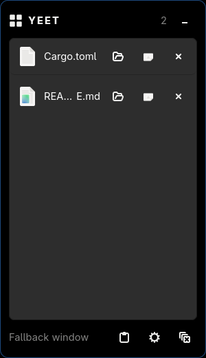

# Yeet

[](https://github.com/hjosugi/yeet/actions/workflows/ci.yml)

**A Yoink-style drag-and-drop shelf for Wayland and Windows.**

Yeet gives you a temporary "shelf" for files while you drag them around.
Drag files onto the shelf, navigate freely to the destination with your
hands off the mouse button, then drag them back out. When the last item
leaves the shelf, it disappears.



> Development status: **main is targeting v0.6.1**, a fix release for a Windows
> launch that flashed console windows and for the polling Yeet did while it sat
> in the tray. The application and Cargo package are named simply Yeet and use
> one native Rust/GTK 4 codebase. v0.6 added a shelf you can drag
> anywhere, one backend per mechanism so GNOME is served by a companion shell
> extension or XWayland rather than by nothing, and `yeetup`, a cross-platform
> installer. Real compositor and interactive Windows verification remains
> tracked separately in the [test matrix](docs/compositors.md); an implemented
> path is not presented as a verified platform result.

## Quick start

On NixOS or another system with flakes enabled:

```sh
nix run github:hjosugi/yeet -- --hidden
```

On other Linux distributions, install GTK 4 and `gtk4-layer-shell`, then use
the [Linux release archive](#install-on-linux) or [build from source](#build-from-source).
Use `yeet --toggle` if the compositor does not support an edge strip.

On Windows, install with [Scoop](https://scoop.sh) —
`scoop bucket add yeet https://github.com/hjosugi/yeet` then `scoop install yeet`
— or download the setup EXE or portable ZIP from
[Releases](https://github.com/hjosugi/yeet/releases). Start Yeet, then press
Ctrl+Alt+Y (the configurable default) or left-click the notification-area icon.
Pressing the same shortcut twice quickly captures the clipboard. Development
and unsigned release artifacts can trigger SmartScreen; see the
[Windows notes](docs/windows.md).

## Why

[Yoink](https://eternalstorms.at/yoink/mac/) solves this beautifully on
macOS, but nothing does it *natively and well* on Wayland. Existing
options are either X11-era, CLI-only ([dragon](https://github.com/mwh/dragon)),
or Electron-based ([DropPoint](https://github.com/GameGodS3/DropPoint)) with
weak Wayland integration. Yeet is a native Rust/GTK 4 app designed for
Wayland first, with Windows kept in the same codebase.

## Comparison

<!-- markdownlint-disable MD013 -->

| Capability | Yeet | Yoink (macOS) | DropPoint | dragon |
| --- | --- | --- | --- | --- |
| Reveal as soon as a drag starts | Yes on X11/XWayland and Windows, on by default | Yes | Manual/shortcut | No |
| Reveal while dragging at a screen edge | Yes, via an always-mapped strip | Yes | Manual/shortcut | CLI launch |
| Native Wayland integration | `gtk4-layer-shell` with a documented fallback | N/A | Chromium/Wayland | GTK 3, X11-first |
| Windows support | Native backend in the same Rust codebase | No | Yes, Electron | No |
| Multi-item drag-out | Yes | Yes | Yes | Yes |
| Text/image snippets | Yes, preserving the stored MIME type | Yes | No | No |
| Hide automatically when empty | Yes | Yes | No | Optional exit mode |

<!-- markdownlint-enable MD013 -->

This table describes product shape, not compositor certification or a
performance benchmark. See the linked verification matrices for tested
environments.

## Core behavior

1. **Summon** — start dragging anything, anywhere, and the shelf comes out to
   meet you. Where the desktop cannot report that a drag began, a few-pixel
   *edge strip* at the edge of the screen catches the drag instead: drag files
   against it and the shelf slides out. Also summonable via global shortcut
   (Ctrl+Alt+Y by default) or `yeet <files…>` from a terminal.
2. **Hold** — drop any number of files (or text/image snippets) onto the
   shelf. Your mouse is free; go find the destination window/workspace.
3. **Release** — drag items (individually, multi-selected, or as a whole
   stack) out of the shelf into any app.
4. **Vanish** — when the last item leaves the shelf, it hides itself. A shelf
   that came out for a drag and was not used goes away with the drag.

### Show while dragging

*Show while dragging* is on by default and is the setting that makes the shelf
behave like Yoink's: it appears the moment a drag starts, rather than when the
drag reaches the screen edge. The two triggers coexist — turning the mode off
in settings leaves the edge strip, the shortcut and the CLI exactly as they
were.

What the mode can be told depends on the session, and the settings switch says
which one you have:

| Session | Drags that summon the shelf |
| --- | --- |
| X11, or Wayland with XWayland running | Every X11 and XWayland drag source, via the XFIXES notification that XDND's own selection changed hands |
| Windows | Any application that draws a drag image, which is what Explorer, browsers and Office all do |
| Wayland with no XWayland | None: a Wayland client is not allowed to see drags outside its own surfaces, so the edge strip stays the trigger |

Yeet learns only *that* a drag exists. Nothing about its contents is read
unless it is dropped on the shelf.

## Running in the background

With an empty shelf, Yeet is a notification-area icon and a few-pixel strip at
the screen edge — no window, and no recurring work. Nothing is polled: the
tray, the global shortcut, the drop targets and the drag watch each wake the
process through the event they are waiting for, so an idle Yeet performs no
timer wakeups at all and reads no clocks.

Drags that reach the strip are detected by the strip itself, which is an
ordinary drop target declared for files, URI lists, text and images. A drag
that carries none of those is not offered to it, and a pointer crossing the
strip without a drag in progress does nothing at all.

*Show while dragging* adds one subscription, and it is a subscription rather
than a hook: on X11 it is `XFixesSelectSelectionInput` on `XdndSelection`, the
selection XDND requires a drag source to own, and on Windows it is an
out-of-context `SetWinEventHook` that reports top-level windows being created
— nothing of Yeet is loaded into the applications being watched. Neither one
reads the drag's contents, and neither can see a drag that does not exist.

The end of a drag is the one thing no such notification reports, so while a
drag Yeet has already reacted to is still in flight, X11 sessions ask the
server every 0.12 seconds whether a pointer button is still held. That
sampling starts with the drag and stops with it; between drags there is
nothing to sample and no timer to run.

The one repeating timer left samples the shelf's position every 0.6 seconds,
and only while the shelf is both on screen and somewhere the user dragged it
to: neither the window manager nor GTK reports the end of an interactive move,
so the position can only be learned by looking. Hiding the shelf takes one
last sample and stops the timer.

## Platform integration

<!-- markdownlint-disable MD013 -->

| | Wayland (Linux) | Windows |
| --- | --- | --- |
| Summon on drag | XFIXES `XdndSelection` owner notification (X11/XWayland) | `SetWinEventHook`, out of context |
| Edge trigger | `zwlr_layer_shell_v1` via `gtk4-layer-shell` | topmost frameless OLE drop-target strip |
| Shelf window | layer-shell overlay surface | frameless topmost tool window |
| Global shortcut | XDG GlobalShortcuts portal, with `yeet --toggle` fallback | configurable, default Ctrl+Alt+Y via `RegisterHotKey` |
| Drag in/out | `wl_data_device` (via GTK/GDK) | OLE (via GTK/GDK) |
| Tray | StatusNotifier menu | native notification-area menu |
| Fallback | regular window mode (GNOME) | — |

<!-- markdownlint-enable MD013 -->

## Current features

- Drop files, folders, URI lists, text and images. Local files are normalized,
  browser HTTP(S) references become explicit shortcuts, and unsupported or
  unavailable URIs are reported instead of silently becoming broken items.
- Drag one item or a Ctrl-selected group back out. Cancelled drags stay on the
  shelf; accepted drops remove only unpinned items. Drags containing a pinned
  item are copy-only, so a move cannot invalidate a saved shelf entry.
- Text and image snippets retain their MIME type and offer both native snippet
  bytes and a file-list fallback during drag-out.
- Atomic shelf persistence and single-instance argument forwarding.
- `yeet FILE...`, `--toggle`, `--clear`, `--hidden` and `--help`.
- Show while dragging: the shelf reveals itself as soon as a drag starts
  anywhere, and steps back out of the way if the drag ends without using it.
  On by default, switchable in settings, and never a replacement for the edge
  strip, the shortcut or the CLI.
- A strip on every monitor; the shelf opens on the monitor the drag entered.
- `gtk4-layer-shell` overlay surfaces where available and a documented GNOME
  shortcut/CLI fallback.
- GTK theme following, a configurable Windows global shortcut (Ctrl+Alt+Y by
  default), and a Windows backend that reapplies `HWND_TOPMOST` whenever the
  shelf is shown. A failed shortcut change reports the conflict and restores
  the previous registration when possible.
- Clipboard capture, image/text preview, context actions, persistent settings,
  configurable edge width, shelf opacity and per-user autostart.
- Drag the shelf by its grip to put it anywhere, and it reappears there next
  time. Choosing a screen edge in settings anchors it back to that edge.
- Full keyboard navigation and GTK accessibility metadata, English/Japanese UI,
  reduced-motion support, and Linux StatusNotifier plus native Windows tray
  menus.
- The Windows notification-area icon shows the shelf item count, toggles the
  shelf on left-click, and offers Show/Hide, Capture Clipboard, Clear, Settings,
  and Quit actions.

Windows-target compilation covers these native paths, but the tray interactions,
shortcut conflict/rollback behavior, and topmost behavior across real Windows
focus/display changes still require the checks in
[Windows behavior and verification](docs/windows.md).

## Install on Windows

### Scoop (recommended)

[Scoop](https://scoop.sh) installs the portable build and keeps it up to date.
The manifest lives in this repository's [`bucket/`](bucket) directory, so add the
repo as a bucket and install:

```powershell
scoop bucket add yeet https://github.com/hjosugi/yeet
scoop install yeet
```

Later, update to the newest release with:

```powershell
scoop update yeet
```

Scoop installs into your user profile (no administrator rights required) and
`scoop uninstall yeet` removes it cleanly. Your settings in
`%APPDATA%\hjosugi\Yeet` are preserved across updates and uninstalls. If another
bucket also provides a `yeet`, disambiguate with `scoop install yeet/yeet`.

### Installer or portable ZIP

Alternatively, download the setup EXE or portable ZIP from
[Releases](https://github.com/hjosugi/yeet/releases). With an empty shelf Yeet
stays in the background — a notification-area icon plus a thin screen-edge strip
— and does not open a window until you summon it with Ctrl+Alt+Y, a tray click,
or a drag against the edge. See the [Windows notes](docs/windows.md) for
SmartScreen and runtime details.

## Install on Linux

### AppImage (no dependencies)

The AppImage carries its own GTK 4 runtime, so it runs on any distribution
without installing anything else:

```sh
curl -fLO https://github.com/hjosugi/yeet/releases/latest/download/yeet-0.6.1-linux-x86_64.AppImage
chmod +x yeet-0.6.1-linux-x86_64.AppImage
./yeet-0.6.1-linux-x86_64.AppImage --hidden
```

### yeetup (installs, updates and removes)

`yeetup` downloads the release for your platform, verifies it against the
published checksums, installs it and records what it wrote:

```sh
curl -fLO https://github.com/hjosugi/yeet/releases/latest/download/yeetup-0.6.1-linux-x86_64
chmod +x yeetup-0.6.1-linux-x86_64
./yeetup-0.6.1-linux-x86_64 install      # into ~/.local, no sudo
```

Later, `yeetup update` moves to the newest release, `yeetup status` reports what
is installed, and `yeetup uninstall` removes exactly the files it added. Use
`--system` to install into `/usr/local` instead, or `--prefix DIR` for any other
location. The same binary is published for Windows and macOS, though the macOS
build is a plain GTK application: it has no platform backend yet, so it has no
always-on-top shelf, no tray icon and no global shortcut.

### Release archive

Download the current release archive and install it under `/usr/local`:

```sh
version=0.6.1
base="https://github.com/hjosugi/yeet/releases/download/v${version}"
curl -fLO "$base/yeet-${version}-linux-x86_64.tar.gz"
curl -fLO "$base/SHA256SUMS-linux.txt"
grep "yeet-${version}-linux-x86_64.tar.gz" SHA256SUMS-linux.txt | sha256sum -c -
tar -xzf "yeet-${version}-linux-x86_64.tar.gz"
root="yeet-${version}-linux-x86_64"
sudo install -Dm755 "$root/bin/yeet" /usr/local/bin/yeet
(cd "$root/share" && find . -type f \
  -exec sudo install -Dm644 '{}' "/usr/local/share/{}" \;)
yeet --hidden
```

Each file is installed individually rather than with `cp -a` on the whole
`share` directory. Distributions such as Arch ship `/usr/local/share/man` as a
symlink into `/usr/share/man`, and a recursive copy tries to replace that
symlink with a directory instead of writing through it.

Install the GTK runtime first:

```sh
# Arch Linux
sudo pacman -S gtk4 gtk4-layer-shell

# Fedora
sudo dnf install gtk4 gtk4-layer-shell

# Ubuntu 25.10 or newer
sudo apt install libgtk-4-1 libgtk4-layer-shell0
```

Ubuntu 24.04 has GTK 4 but no `gtk4-layer-shell` package. Install the pinned
upstream library used by CI before running Yeet:

```sh
sudo apt update
sudo apt install libgtk-4-dev libwayland-dev wayland-protocols meson ninja-build
git clone --depth 1 --branch v1.3.0 \
  https://github.com/wmww/gtk4-layer-shell.git /tmp/gtk4-layer-shell
meson setup /tmp/gtk4-layer-shell/build /tmp/gtk4-layer-shell \
  --prefix=/usr/local -Dexamples=false -Ddocs=false -Dtests=false \
  -Dintrospection=false -Dvapi=false
ninja -C /tmp/gtk4-layer-shell/build
sudo ninja -C /tmp/gtk4-layer-shell/build install
sudo ldconfig
```

The release archive currently targets x86-64. Arch users can alternatively
build `packaging/arch/PKGBUILD`; Nix users can run
`nix run github:hjosugi/yeet`.

## Build from source

Requires Rust ≥ 1.92, GTK ≥ 4.10 and, on Wayland,
`gtk4-layer-shell`. Install the development packages provided by your
distribution. Ubuntu 24.04 does not package the GTK4 version of layer-shell;
the CI workflow shows the pinned upstream source-build commands used there.

```sh
cargo build --release
cargo test
./target/release/yeet --hidden
```

At runtime Yeet checks whether layer-shell is supported. If it is unavailable,
the shelf uses a regular window and no edge strip is created. Bind
`yeet --toggle` in the compositor configuration for that fallback. Windows
builds use the UCRT64 GTK package in MSYS2; CI contains the exact setup.

PDF previews use `pdftoppm` when Poppler is installed and otherwise open in
the system's default PDF application.

See [Wayland compositor verification](docs/compositors.md),
[Yeet on GNOME](docs/gnome.md) and
[Windows behavior and limitations](docs/windows.md) before filing a
platform-specific bug. Contributors updating README media should follow the
[reproducible demo-capture contract](docs/demo-capture.md); missing captures are
tracked there and must not be replaced with mockups.

## Troubleshooting

**Console windows flash open and shut when Yeet starts (Windows).** In v0.6.0
and earlier, Yeet read the Windows light/dark setting by running `reg.exe`, and
did so on every realize and map of the shelf and of every edge strip. From the
GUI subsystem each of those spawns gets its own console window, so a launch
flashed roughly ten of them and paid for a process spawn each time. The theme
read and the autostart entry now use the registry API directly: nothing is
spawned, and no console appears. PDF previews, which do still run `pdftoppm`,
create it with `CREATE_NO_WINDOW`.

**A launch that leaves nothing on screen.** Start-up failures are appended to a
log file, because a GUI-subsystem process has no console to print them to:

<!-- markdownlint-disable MD013 -->

| Platform | Log |
| --- | --- |
| Windows | `%LOCALAPPDATA%\hjosugi\Yeet\data\yeet.log` |
| Linux | `$XDG_DATA_HOME/yeet/yeet.log`, usually `~/.local/share/yeet/yeet.log` |
| macOS | `~/Library/Application Support/io.hjosugi.Yeet/yeet.log` |

<!-- markdownlint-enable MD013 -->

`yeet --help` prints the path for the machine it runs on. Rust panics and GTK's
own warnings both land there, so a session that cannot open a display records
that instead of losing it with the console. A launch that leaves *nothing* in
the log never reached Yeet's own code at all: on Windows that means the GTK
runtime could not be loaded, so install with the setup EXE or Scoop rather than
copying `yeet.exe` out of the portable ZIP on its own.

**Diagnostics.** `YEET_BACKEND` forces the Linux shelf backend
(`layer-shell`, `x11`, `extension` or `plain`) when the automatic choice is
wrong, and `YEET_DEBUG` traces the desktop-portal exchange behind the global
shortcut on stderr. Both are listed by `yeet --help`.

## Prior art & credits

- [Yoink for Mac](https://eternalstorms.at/yoink/mac/) by Eternal Storms
  Software — the original UX this project chases.
- [DropPoint](https://github.com/GameGodS3/DropPoint) — cross-platform
  Electron shelf; reference for tray/shortcut UX and drag-out handling.
- [dragon](https://github.com/mwh/dragon) — drag-and-drop source/sink
  for the terminal.

## License

MIT — see [LICENSE](LICENSE).
